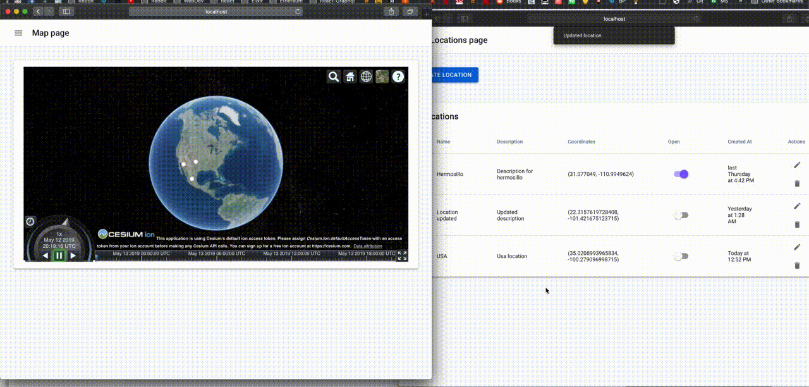

# Real time map with Cesium

This project is made with `React`, `Redux`, `Redux-observable` for async api calls, and socket.io client to emit and listen events. The map and locations are with Cesium using the Cesium react componentes with [resium](https://github.com/darwin-education/resium) and [craco-cesium](https://github.com/darwin-education/craco-cesium) for the create react setup.

The backend of this project is made with `Express` and `socket.io`. Using `PostgreSQL` as the RDBMS.

## Requirements

Minimum node version 8, used:
```bash
node version 8.11.2
```

Sequelize cli and nodemon
```bash
yarn global add sequelize-cli nodemon
```

Postgresql is required

```bash
https://www.postgresql.org/download/
```

## Installation

Front end in root directory run:
```bash
yarn 
```

Back end run:
```bash
$ cd server
$ yarn
```

Set up the database
```bash
$ cd server
$ psql postgres --u postgres

> CREATE ROLE skyc WITH LOGIN PASSWORD 'skyc';
> ALTER ROLE skyc CREATEDB;
> CREATE DATABASE skyc_rt;
> GRANT ALL PRIVILEGES ON DATABASE skyc_rt TO skyc;
> \q
```

Migrate the database, in the server folder (on `./server`)
```bash
sequelize db:migrate
```


## Usage

To run the front end project, in a terminal window run:
```bash
$ yarn start
```

To run the front end project, in a another terminal window run:
```bash
$ cd server
$ yarn start
```

## Project structure
```bash
├── public
├── server # expressJs server
│   ├── config 
│   │   ├── config.json # config for the databse
│   ├── setup
│   │   ├── express.js #setup express server, middlewares, routes and error handlings
│   │   └── logger.js #logger for better debugging
│   ├── src
│   │   └── controllers # controllers that handle crud operations
│   │   ├── migrations # migrations made by sequelize
│   │   ├── models # models for the database
│   │   ├── route # endpoints for the api
│   │   └── sockets # socket listenings and emit
├── src #client app
│   ├── components # pure fuctions components
│   ├── routes # application routes
│   ├── state
│   │   ├── ducks
│   │   │   ├── locations #locations redux logic (locations crud)
│   │   │   │   ├── actions.js #actions used to handle requests
│   │   │   │   ├── epics.js #redux observable epic used to make api calls
│   │   │   │   ├── index.js # export operations and reducer
│   │   │   │   ├── operations.js #import and export actions
│   │   │   │   ├── reducers.js # all the reducers
│   │   │   │   └── types.js # types used for actions and reducers
│   │   │   └── items #items redux logic (items list and item)
│   │   ├── middlewares # logger middleware for prettify actions
│   │   ├── utils # create reducer logic
│   │   └── store.js #set up the application store for the provider
│   ├── utils 
│   └── views 
│       ├── layouts #global layout 
│       └── pages #all pages
├── package.json
└── README.md
```


## Demo



## Contributing
Pull requests are welcome. For major changes, please open an issue first to discuss what you would like to change.

## License
[MIT](https://choosealicense.com/licenses/mit/)
